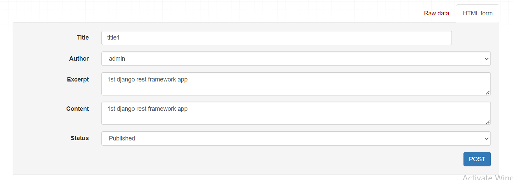
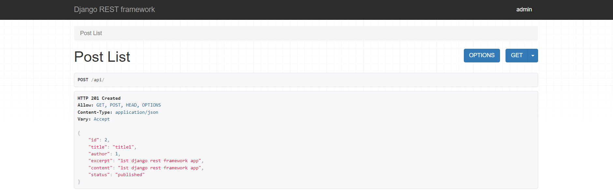
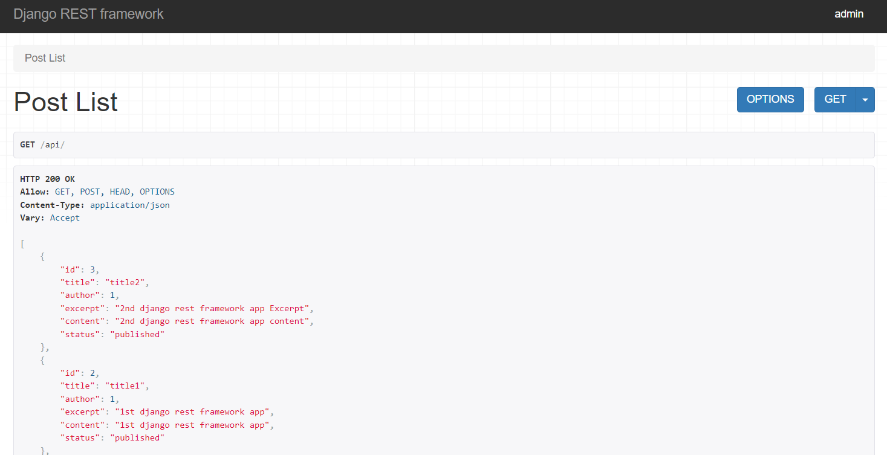
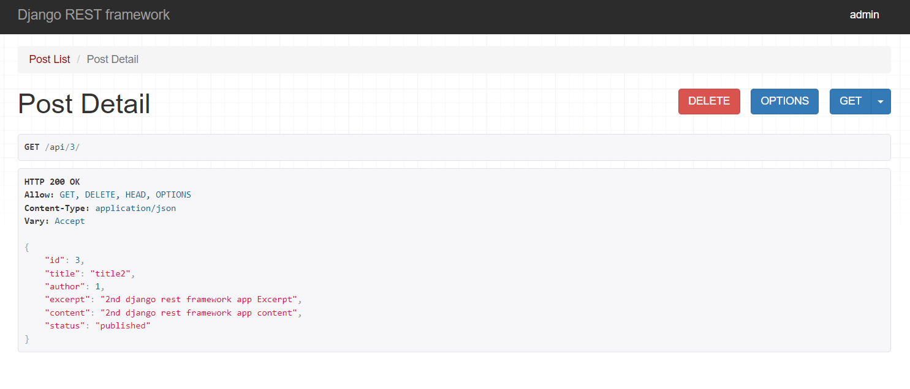
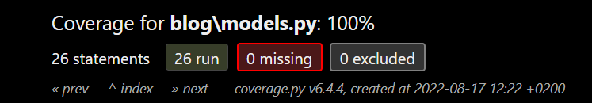
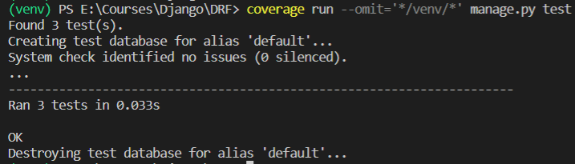
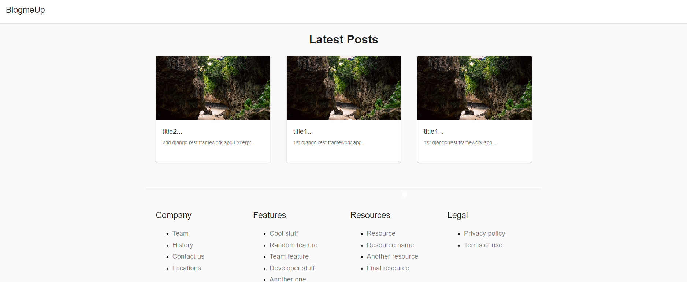

# Blog_Web_Application
* A Full Stack Web Application using Django and React.JS where user can post different blogs.
* Users can also see other people's blog also.
* Included test cases for each app.
* Server built using django rest framework

## **Django Rest Framework Server**

<h2 align="center">Posts Creation</h2>

---

<h2 align="center">Post Created Success</h2>

--- 

<h2 align="center">View Posts</h2>

---

<h2 align="center">View/Delete Specific Post with id </h2>

---
## **Django Test Cases**

<h2 align="center">Tests Coverage</h2>

---

<h2 align="center">Run Tests</h2>

--- 
## **React App**

<h2 align="center">View Posts</h2>

